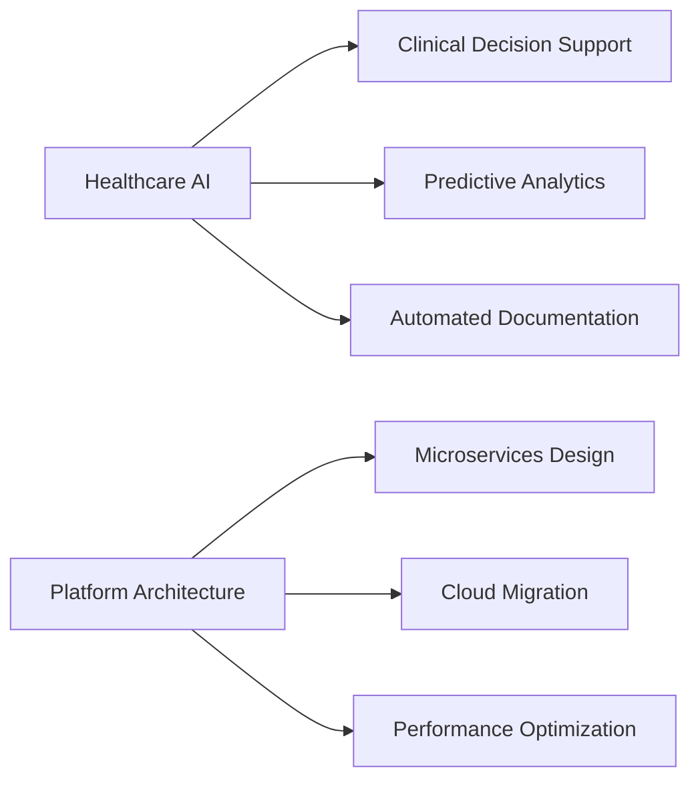

# Ahzam Fawmee
**Lead Software Engineer & Solutions Architect**  
*Architecting scalable, secure AI-powered healthcare solutions that impact millions of users*

[](https://linkedin.com/in/ahzaam-fawmee)
[](https://github.com/Ahzaam)
[](https://your-portfolio.com)

---

## 🚀 Engineering Leadership & Impact

**4+ years** of architecting and delivering enterprise-grade healthcare solutions trusted by healthcare providers managing **10,000+ patients** across multiple EMR ecosystems. Currently leading cross-functional teams across **3 continents** to build HIPAA-compliant, AI-driven platforms that streamline clinical workflows and improve patient outcomes.

### 🏥 Healthcare Technology Expertise
- **EMR Integration Specialist**: Deep integration experience with Salesforce Health Cloud, Bayada, and Clearcare systems
- **Compliance Architecture**: HIPAA, SOC 2, and healthcare data governance expert
- **AI-Powered Solutions**: Deployed production ML models for predictive analytics and clinical decision support
- **Real-time Clinical Data**: Built streaming architectures handling sensitive healthcare data at scale

### 🤖 AI & Machine Learning Innovation
```
🧠 Large Language Models (LLMs) fine-tuning and deployment
🔍 Zero-shot classification for clinical documentation
📊 Predictive analytics for patient risk assessment
🗣️ Speech-to-text solutions for clinical note-taking
```

---

## 🛠️ Technical Architecture

### **Cloud-Native & Scalable Systems**
```typescript
// Architecture I build and lead
const myExpertise = {
  architecture: ["Microservices", "Event-Driven", "Serverless", "Edge Computing"],
  scale: ["Multi-region deployments", "Auto-scaling", "Load balancing"],
  security: ["Zero-trust", "End-to-end encryption", "Identity management"]
}
```

### **Full-Stack Mastery**
| **Frontend Excellence** | **Backend Architecture** | **Cloud Infrastructure** |
|------------------------|--------------------------|---------------------------|
| React, Angular, Next.js | Node.js, Python, .NET | Azure, AWS, GCP |
| TypeScript, Vue, Svelte | FastAPI, GraphQL | Kubernetes, Docker |
| State Management (Redux) | WebSockets, RTMP | Terraform, Jenkins |

### **Data & AI Stack**
| **Databases** | **AI/ML Frameworks** | **Integration** |
|---------------|---------------------|-----------------|
| PostgreSQL, MySQL | TensorFlow, PyTorch | REST, GraphQL |
| MSSQL, Firebase | Hugging Face, OpenAI | WebSockets, MQTT |
| Real-time streaming | Predictive Analytics | EMR APIs, HL7 FHIR |

---

## 💼 Leadership & Business Impact

### **🌟 Founder - BuyON.lk**
Building Sri Lanka's next-generation eCommerce platform with modern architecture and AI-driven personalization.

### **👥 Global Team Leadership**
- Managing distributed engineering teams across **Asia, Europe, and North America**
- Implementing agile methodologies and DevOps practices
- Mentoring junior developers and establishing coding standards

### **🔧 Technical Decision Making**
- Architecting solutions that reduced system latency by **60%**
- Implementing CI/CD pipelines that improved deployment frequency by **300%**
- Leading technical reviews and establishing engineering best practices

---

## 🌐 Specialized Integrations & IoT

```python
# IoT & Edge Computing Projects
iot_expertise = {
    "hardware": ["ESP-32", "Raspberry Pi", "Custom sensor arrays"],
    "protocols": ["MQTT", "HiveMQTT", "WebRTC", "HLS"],
    "sensors": ["ECG monitoring", "Temperature", "GPS tracking"],
    "applications": ["Remote patient monitoring", "Real-time analytics"]
}
```

### **Enterprise Integrations**
- **Communication**: Twilio, WhatsApp Business API, Zoom SDK
- **Social Platforms**: Instagram Graph API, social media automation
- **Design Systems**: Figma API integration for design-to-code workflows

---

## 📈 Current Focus



**2024 Objectives:**
- Expanding AI capabilities in clinical decision support systems
- Optimizing healthcare data pipelines for real-time analytics
- Leading digital transformation initiatives for healthcare providers

---

## 🤝 Let's Connect

I'm passionate about solving complex healthcare challenges through innovative technology. Whether you're looking to discuss **healthcare AI**, **system architecture**, or **technical leadership**, I'd love to connect.

**📧 Email**: [your-email@domain.com]  
**💼 LinkedIn**: [Connect with me](https://linkedin.com/in/ahzaam-fawmee)  
**🌐 Portfolio**: [View my work](https://your-portfolio.com)

---

<div align="center">

*"Building technology that makes healthcare more accessible, efficient, and human-centered."*

[](https://github.com/Ahzaam)

</div>
